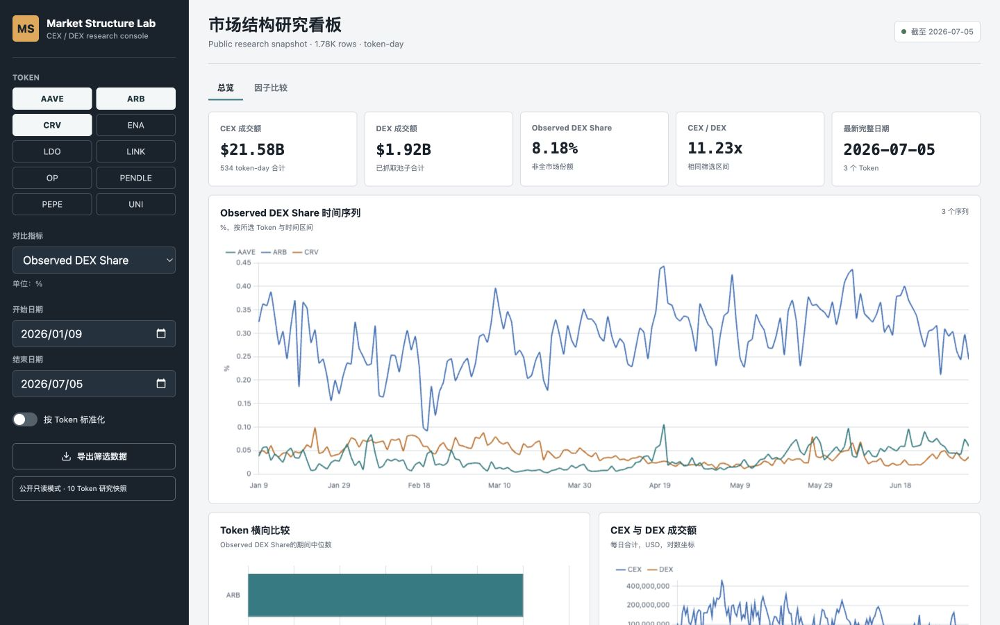

# Public Read-only Sharing

The dashboard has two intentionally separate runtime modes.



## Private workspace

```bash
./scripts/run_dashboard.sh
```

Private mode reads the richest local research panel and enables notes,
checklists, state saves, and append-only history. It binds to `127.0.0.1` by
default and should not be exposed directly to the internet.

## Public read-only mode

```bash
./scripts/run_public_dashboard.sh --port 8766
```

Public mode:

- defaults to the curated 10-token panel under `data/public/`;
- rejects data paths outside `data/public/`, `data/mock/`, and `dashboard/sample/`;
- removes the private workspace tab and save controls;
- rejects `POST /api/state` with HTTP 403;
- does not return private state or history;
- exposes only aggregate fields selected by `scripts/build_public_snapshot.py`.

For a temporary HTTPS link that can be opened from any network, run:

```bash
./scripts/share_public_dashboard.sh
```

The command prints a random `https://…trycloudflare.com` address. It lasts only
while the command and this computer remain running. Cloudflare documents Quick
Tunnels as a testing and demo facility, not a permanent hosting service.

The command listens on all network interfaces. On the same network, another
person can open `http://YOUR_LOCAL_IP:8766` while the process is running and
the local firewall permits the connection.

## Long-running public deployment

The included Docker image always starts in public read-only mode:

```bash
docker build -t market-structure-dashboard .
docker run --rm -p 8765:8765 market-structure-dashboard
```

This repository includes `render.yaml` for a long-running Render deployment.
Render builds the Docker image from the linked GitHub branch, checks `/health`,
and supplies a stable public HTTPS URL. Automatic deploys run only after the
GitHub checks pass.

The Dockerfile copies only the dashboard application and `data/public/` into a
non-root runtime image. Do not mount private state files or review directories
into the public container. Review `DATA_USAGE.md` before each data refresh.

## Update workflow

1. Refresh or replace the reviewed B-side panel.
2. Run `make release` to rebuild `data/public/` and run all checks.
3. Review `data/public/research/manifest.json` and the dashboard locally.
4. Commit and push. Render deploys the tested commit automatically.
