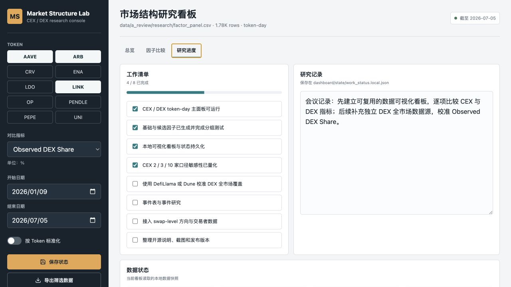

# Market Structure Dashboard

This local dashboard turns the B-side research outputs into an interactive CEX / DEX comparison tool.


## Run

```bash
./scripts/run_dashboard.sh
```

Then open `http://127.0.0.1:8765`.

The server reads the richest available panel in this order:

1. `DASHBOARD_DATA` environment override
2. `data/a_review/research/factor_panel.csv`
3. `data/research/factor_panel.csv`
4. `data/processed/research_panel.csv`
5. `data/processed/merged_volume_panel.csv`

Filters, notes, and checklist status are saved to `dashboard/state/work_status.local.json`. Each save is also appended to `dashboard/state/work_history.local.jsonl` with the active data fingerprint and task progress. Both local files are ignored by Git; `work_status.example.json` is the source-controlled initial state.



## Main views

- Overview: CEX / DEX totals, observed DEX share, metric trends, token comparison, scope sensitivity, and coverage details.
- Factors: candidate-factor buckets versus 1d / 3d / 7d / 14d future returns.
- Research status: persistent checklist, notes, source path, freshness, and data completeness.

`Observed DEX Share` is deliberately named to avoid implying global market coverage. The current DEX input contains selected pools, not every DEX venue.

## Public sample

Run the versioned synthetic sample without relying on redistributed exchange
data:

```bash
./scripts/run_dashboard.sh --data data/mock/research/factor_panel.csv
```

See `dashboard/sample/manifest.json` and `DATA_USAGE.md` for provenance and
licensing boundaries.

For a shareable read-only process, use:

```bash
./scripts/run_public_dashboard.sh --port 8766
```

See `dashboard/PUBLIC_SHARING.md` for LAN and Docker deployment options. Public
mode is enforced by the backend: it uses the curated 10-token snapshot under
`data/public/`, hides private tools, and rejects state writes. The Docker image
does not contain the private workspace or the source review directory.

For a temporary public HTTPS link, run `./scripts/share_public_dashboard.sh`.

## Routine update

After the research panel changes, run `make release` to rebuild the curated
public snapshot and execute the test suite. Review the result, commit it, and
push it; the Render Blueprint waits for GitHub checks before deploying the new
container.

## Refresh observed data

After the A-side pipeline has written its processed panel, rebuild the B-side
research outputs with:

```bash
./scripts/refresh_research_dashboard.sh
```

The dashboard reads the refreshed `data/a_review/research/factor_panel.csv` on
the next page reload.
